# Dirt Detection Performance

## DirtNet GPU version

### Backbone Darknet53

#### Model size
| Original | After freezing |
| -------- | -------------- |
| 998 MB   | 235 MB         |

#### Speed
| Capture images | Preprocessing | Detection | Total   |
| -------------- | ------------- | --------- | ------- |
| 13.4 ms        | 5.3 ms        | 70.6 ms   | 89.3 ms |

- Time for detection includes model inference and image postprocessing
- Camera resolution 1024 * 1280, network inference with resized resolution 832 * 1024
- Tested with Nvidia GTX 1080Ti

#### Results with 10 classes
- Criterion
1. IOU > 50%
2. right classification
- Result in setting
1. SCORE_THRESHOLDS = 0.25
2. SCORE_THRESHOLDM = 0.3
3. SCORE_THRESHOLDL = 0.3
4. IOU_THRESHOLD    = 0.1

##### Results in real test set (Test)

| Class               | Images | Targets | Precision | Recall | mAP   | F1   |
| ------------------- | ------ | ------- | --------- | ------ | ----- | ---- |
| dirt                | 80     | 360     | 70.2      | 78.6   | 73.7  | 74.2 |
| pens                | 80     | 39      | 82.6      | 97.4   | 96.9  | 89.4 |
| paper_and_notebooks | 80     | 61      | 88.9      | 78.7   | 73.0  | 83.5 |
| keys                | 80     | 23      | 53.7      | 95.7   | 86.7  | 68.8 |
| usb_sticks          | 80     | 28      | 73.5      | 89.3   | 84.8  | 80.6 |
| other               | 80     | 19      | 87.5      | 36.8   | 34.9  | 51.9 |
| rulers              | 80     | 23      | 73.1      | 82.6   | 81.3  | 77.6 |
| business_cards      | 80     | 41      | 80.5      | 80.5   | 79.0  | 80.5 |
| scissors            | 80     | 26      | 83.9      | 100.0  | 100.0 | 91.2 |
| tapes               | 80     | 24      | 92.3      | 100.0  | 96.8  | 96.0 |
| all                 | 80     | 644     | 78.6      | 84.0   | 80.7  | 79.4 |

##### Results in synthetic test set with test floors (TestSynth)

| Class               | Images | Targets | Precision | Recall | mAP   | F1   |
| ------------------- | ------ | ------- | --------- | ------ | ----- | ---- |
| dirt                | 1360   | 8182    | 64.4      | 85.4   | 81.0  | 73.4 |
| pens                | 1360   | 310     | 52.0      | 99.7   | 97.0  | 68.4 |
| paper_and_notebooks | 1360   | 949     | 72.9      | 98.9   | 75.2  | 84.0 |
| keys                | 1360   | 425     | 64.7      | 49.2   | 42.4  | 55.9 |
| usb_sticks          | 1360   | 603     | 79.2      | 88.4   | 84.1  | 83.5 |
| other               | 1360   | 585     | 40.7      | 28.5   | 13.9  | 33.6 |
| rulers              | 1360   | 440     | 77.7      | 88.6   | 87.6  | 82.8 |
| business_cards      | 1360   | 1423    | 88.0      | 64.7   | 64.6  | 74.6 |
| scissors            | 1360   | 414     | 94.7      | 98.6   | 98.5  | 96.6 |
| tapes               | 1360   | 309     | 99.7      | 100.0  | 100.0 | 99.8 |
| all                 | 1360   | 13640   | 73.4      | 80.2   | 74.4  | 75.3 |

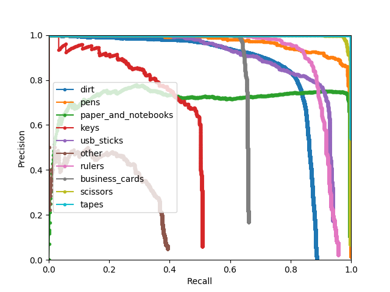

##### Results in synthetic test set with training floors (TestSynthTF)

| Class               | Images | Targets | Precision | Recall | mAP  | F1   |
| ------------------- | ------ | ------- | --------- | ------ | ---- | ---- |
| dirt                | 3448   | 20694   | 77.9      | 84.1   | 79.9 | 80.9 |
| pens                | 3448   | 745     | 49.7      | 99.9   | 97.8 | 66.3 |
| paper_and_notebooks | 3448   | 2490    | 73.2      | 99.6   | 76.7 | 84.4 |
| keys                | 3448   | 1072    | 63.8      | 47.3   | 40.6 | 54.3 |
| usb_sticks          | 3448   | 1531    | 78.2      | 84.5   | 80.2 | 81.3 |
| other               | 3448   | 1432    | 39.1      | 30.6   | 14.0 | 34.3 |
| rulers              | 3448   | 1052    | 89.3      | 90.1   | 89.5 | 89.7 |
| business_cards      | 3448   | 3623    | 88.3      | 64.4   | 64.2 | 74.5 |
| scissors            | 3448   | 1079    | 94.0      | 96.8   | 96.6 | 95.4 |
| tapes               | 3448   | 765     | 98.8      | 99.9   | 99.8 | 99.3 |
| all                 | 3448   | 34483   | 75.2      | 79.7   | 73.9 | 76.0 |

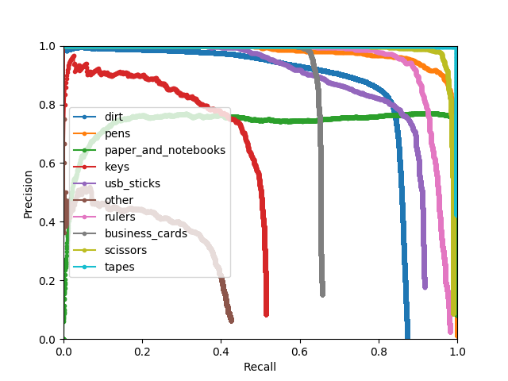

#### Results with 2 classes
- Criterion
1. IOU > 50%
2. right classification
- Result in setting
1. SCORE_THRESHOLDS = 0.25
2. SCORE_THRESHOLDM = 0.3
3. SCORE_THRESHOLDL = 0.3
4. IOU_THRESHOLD    = 0.1

##### Results in real test set (Test)

| Class  | Images | Targets | Precision | Recall | mAP  | F1   |
| ------ | ------ | ------- | --------- | ------ | ---- | ---- |
| dirt   | 80     | 360     | 71.9      | 83.9   | 78.9 | 77.4 |
| object | 80     | 284     | 84.7      | 93.7   | 92.1 | 89.0 |
| all    | 80     | 644     | 78.3      | 88.7   | 85.5 | 83.2 |

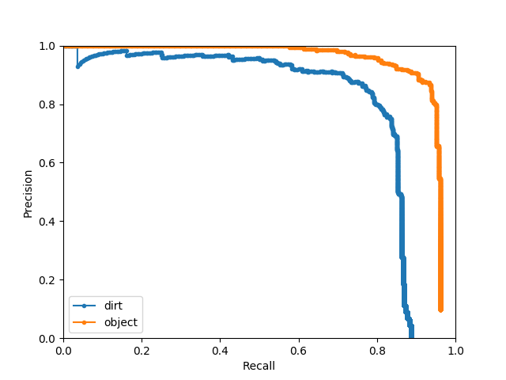

##### Results in synthetic test set with test floors (TestSynth)

| Class  | Images | Targets | Precision | Recall | mAP  | F1   |
| ------ | ------ | ------- | --------- | ------ | ---- | ---- |
| dirt   | 1360   | 8182    | 65.7      | 84.9   | 81.0 | 74.1 |
| object | 1360   | 5458    | 88.8      | 89.7   | 88.2 | 89.3 |
| all    | 1360   | 13640   | 77.2      | 87.2   | 84.6 | 81.6 |

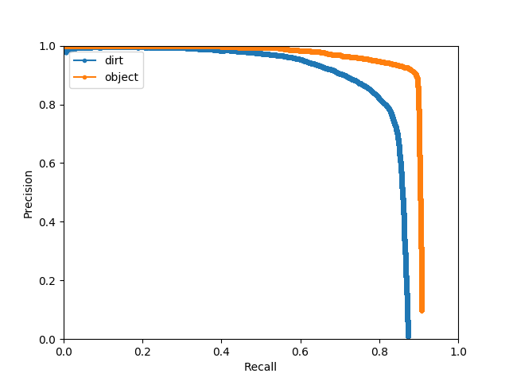

##### Results in synthetic test set with training floors (TestSynthTF)

| Class  | Images | Targets | Precision | Recall | mAP  | F1   |
| ------ | ------ | ------- | --------- | ------ | ---- | ---- |
| dirt   | 3448   | 20694   | 77.6      | 84.4   | 80.5 | 80.9 |
| object | 3448   | 13789   | 89.0      | 88.8   | 87.4 | 88.9 |
| all    | 3448   | 34483   | 83.3      | 86.6   | 83.9 | 84.8 |

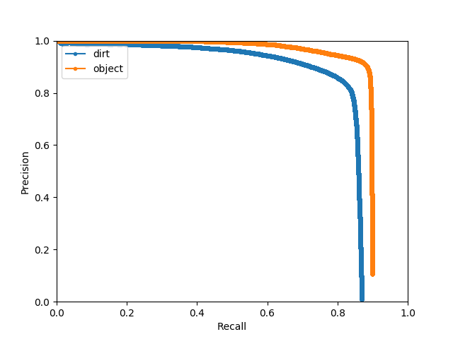

### Backbone MobileNetV2

#### Model size
| Original | After freezing |
| -------- | -------------- |
| 115.0 MB | 26.1 MB        |

#### Speed
| Capture images | Preprocessing | Detection | Total   |
| -------------- | ------------- | --------- | ------- |
| 16.6 ms        | 8.8 ms        | 33.1 ms   | 58.5 ms |

- Time for detection includes model inference and image postprocessing
- Camera resolution 1024 * 1280, network inference with resolution 832 * 1024
- Tested with Nvidia GTX 1080Ti

#### Results with 10 classes
- Criterion
1. IOU > 50%
2. right classification
- Result in setting
1. SCORE_THRESHOLDS = 0.25
2. SCORE_THRESHOLDM = 0.3
3. SCORE_THRESHOLDL = 0.3
4. IOU_THRESHOLD    = 0.1

##### Results in real test set (Test)

| Class               | Images | Targets | Precision | Recall | mAP   | F1    |
| ------------------- | ------ | ------- | --------- | ------ | ----- | ----- |
| dirt                | 80     | 360     | 79.6      | 78.1   | 75.3  | 78.8  |
| pens                | 80     | 39      | 90.7      | 100.0  | 100.0 | 95.1  |
| paper_and_notebooks | 80     | 61      | 92.1      | 95.1   | 90.1  | 93.5  |
| keys                | 80     | 23      | 47.7      | 91.3   | 73.0  | 62.7  |
| usb_sticks          | 80     | 28      | 64.5      | 71.4   | 65.2  | 67.8  |
| other               | 80     | 19      | 29.4      | 26.3   | 22.9  | 27.8  |
| rulers              | 80     | 23      | 82.4      | 60.9   | 58.9  | 70.0  |
| business_cards      | 80     | 41      | 80.4      | 90.2   | 89.9  | 85.1  |
| scissors            | 80     | 26      | 92.6      | 96.2   | 95.3  | 94.3  |
| tapes               | 80     | 24      | 100.0     | 100.0  | 100.0 | 100.0 |
| all                 | 80     | 644     | 75.9      | 80.9   | 77.1  | 77.5  |

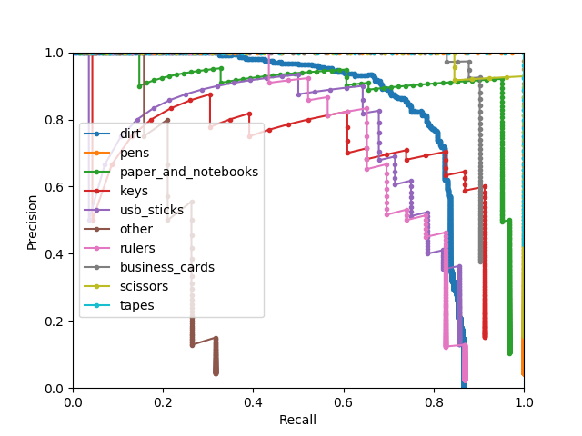

##### Results in synthetic test set with test floors (TestSynth)

| Class               | Images | Targets | Precision | Recall | mAP   | F1   |
| ------------------- | ------ | ------- | --------- | ------ | ----- | ---- |
| dirt                | 1360   | 8182    | 76.1      | 79.3   | 70.9  | 77.7 |
| pens                | 1360   | 310     | 53.8      | 99.7   | 93.7  | 69.9 |
| paper_and_notebooks | 1360   | 949     | 72.0      | 99.7   | 87.1  | 83.6 |
| keys                | 1360   | 425     | 41.6      | 45.2   | 24.1  | 43.3 |
| usb_sticks          | 1360   | 603     | 68.3      | 80.9   | 61.0  | 74.1 |
| other               | 1360   | 585     | 34.4      | 22.6   | 7.8   | 27.2 |
| rulers              | 1360   | 440     | 77.7      | 76.1   | 74.6  | 76.9 |
| business_cards      | 1360   | 1423    | 82.8      | 69.6   | 69.4  | 75.6 |
| scissors            | 1360   | 414     | 99.0      | 95.4   | 95.3  | 97.2 |
| tapes               | 1360   | 309     | 99.7      | 100.0  | 100.0 | 99.8 |
| all                 | 1360   | 13640   | 70.5      | 76.8   | 68.4  | 72.5 |

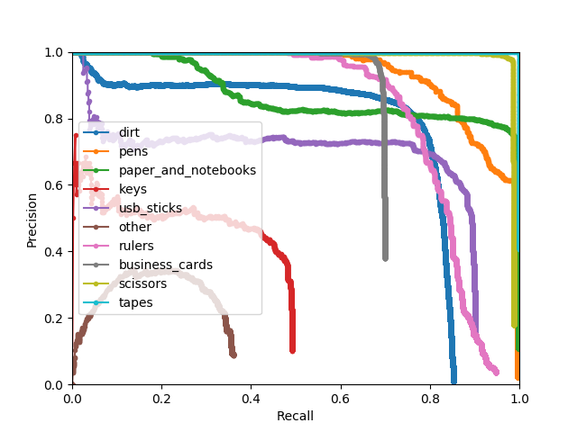

##### Results in synthetic test set with training floors (TestSynthTF)

| Class               | Images | Targets | Precision | Recall | mAP   | F1   |
| ------------------- | ------ | ------- | --------- | ------ | ----- | ---- |
| dirt                | 3448   | 20694   | 78.3      | 78.6   | 69.8  | 78.4 |
| pens                | 3448   | 745     | 51.8      | 99.1   | 92.9  | 68.0 |
| paper_and_notebooks | 3448   | 2490    | 66.1      | 99.7   | 90.2  | 79.5 |
| keys                | 3448   | 1072    | 39.4      | 37.8   | 17.6  | 38.6 |
| usb_sticks          | 3448   | 1531    | 69.3      | 79.3   | 60.9  | 74.0 |
| other               | 3448   | 1432    | 30.0      | 21.3   | 6.7   | 24.9 |
| rulers              | 3448   | 1052    | 95.5      | 76.8   | 76.4  | 85.1 |
| business_cards      | 3448   | 3623    | 82.9      | 68.8   | 68.6  | 75.2 |
| scissors            | 3448   | 1079    | 98.9      | 91.8   | 91.6  | 95.2 |
| tapes               | 3448   | 765     | 97.6      | 100.0  | 100.0 | 98.8 |
| all                 | 3448   | 34483   | 71.0      | 75.3   | 67.5  | 71.8 |

#### Results with 2 classes
- Criterion
1. IOU > 50%
2. right classification
- Result in setting
1. SCORE_THRESHOLDS = 0.25
2. SCORE_THRESHOLDM = 0.3
3. SCORE_THRESHOLDL = 0.3
4. IOU_THRESHOLD    = 0.1

##### Results in real test set (Test)

| Class  | Images | Targets | Precision | Recall | mAP  | F1   |
| ------ | ------ | ------- | --------- | ------ | ---- | ---- |
| dirt   | 80     | 360     | 81.6      | 80.0   | 77.8 | 80.8 |
| object | 80     | 284     | 84.0      | 92.6   | 89.8 | 88.1 |
| all    | 80     | 644     | 82.8      | 86.3   | 83.8 | 84.4 |

##### Results in synthetic test set with test floors (TestSynth)

| Class  | Images | Targets | Precision | Recall | mAP  | F1   |
| ------ | ------ | ------- | --------- | ------ | ---- | ---- |
| dirt   | 1360   | 8182    | 76.1      | 80.0   | 75.3 | 78.0 |
| object | 1360   | 5458    | 88.2      | 89.6   | 87.9 | 88.9 |
| all    | 1360   | 13640   | 82.1      | 84.8   | 81.6 | 83.4 |

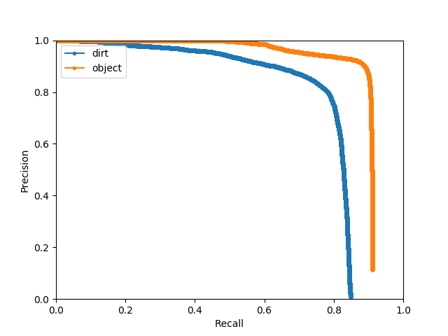

##### Results in synthetic test set with training floors (TestSynthTF)

| Class  | Images | Targets | Precision | Recall | mAP  | F1   |
| ------ | ------ | ------- | --------- | ------ | ---- | ---- |
| dirt   | 3448   | 20694   | 80.2      | 78.1   | 72.9 | 79.2 |
| object | 3448   | 13789   | 86.6      | 87.8   | 85.9 | 87.2 |
| all    | 3448   | 34483   | 83.4      | 82.9   | 79.4 | 83.1 |

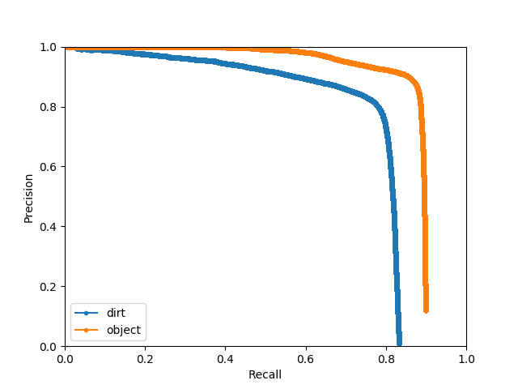

## DirtNet optimized for CPU

### Backbone MobileNetV2

#### Model size
| Original | After freezing |
| -------- | -------------- |
| 115.0 MB | 26.1 MB        |

#### Speed
| Capture images | Preprocessing | Detection | Total    |
| -------------- | ------------- | --------- | -------- |
| 82.2 ms        | 4.1 ms        | 38.8 ms   | 125.1 ms |

- Time for detection includes model inference and image postprocessing
- Camera resolution 1024 * 1280, network inference with resolution 832 * 1024
- Intel Core i7-7700K CPU @ 4.20GHz * 8

## Exemplary result images

### Results in real test set (Test)

#### 10 classes

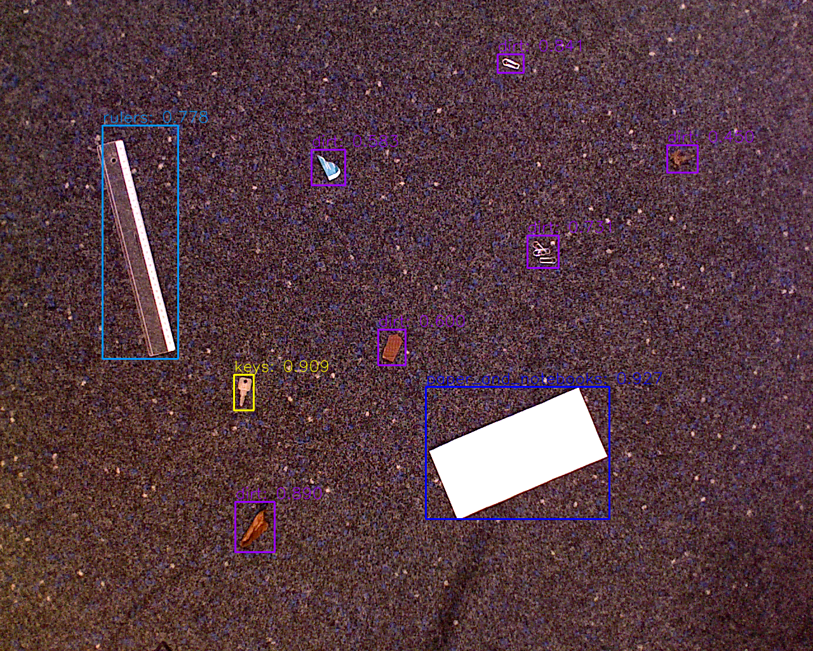
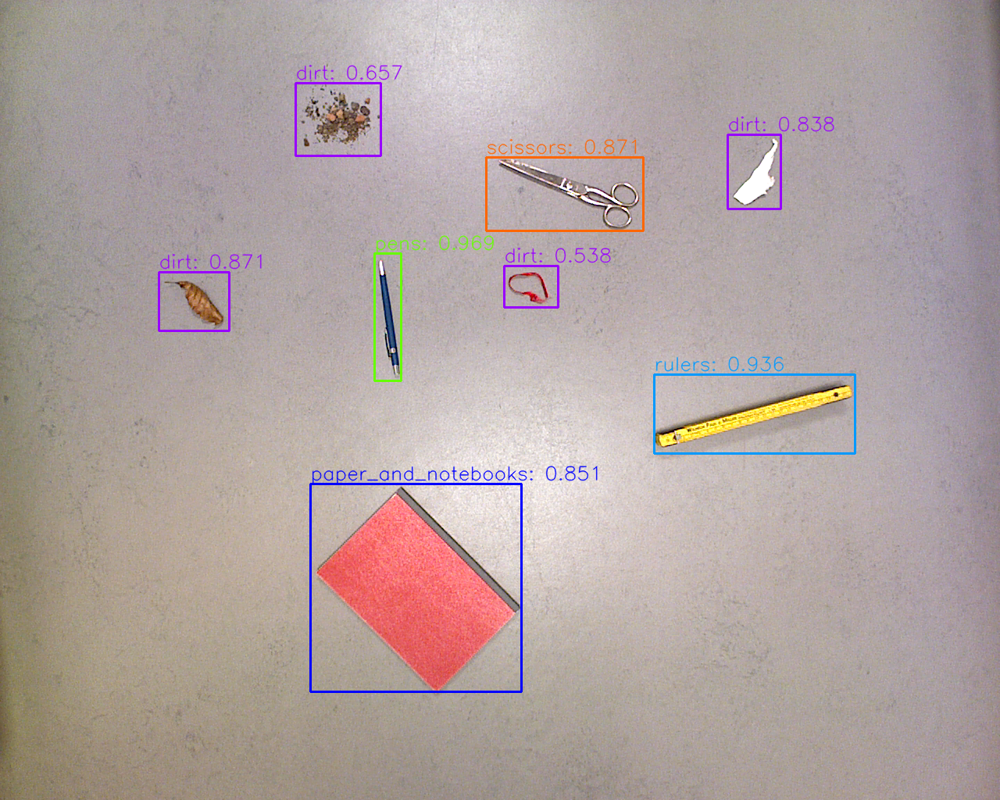

#### 2 classes

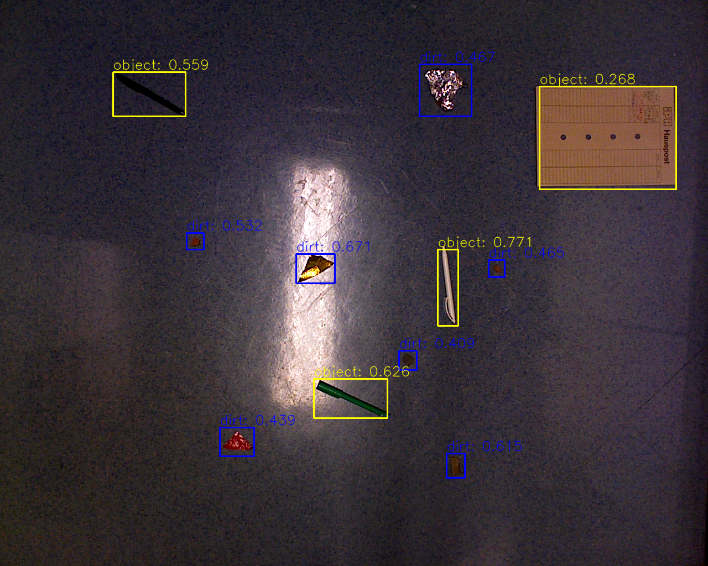
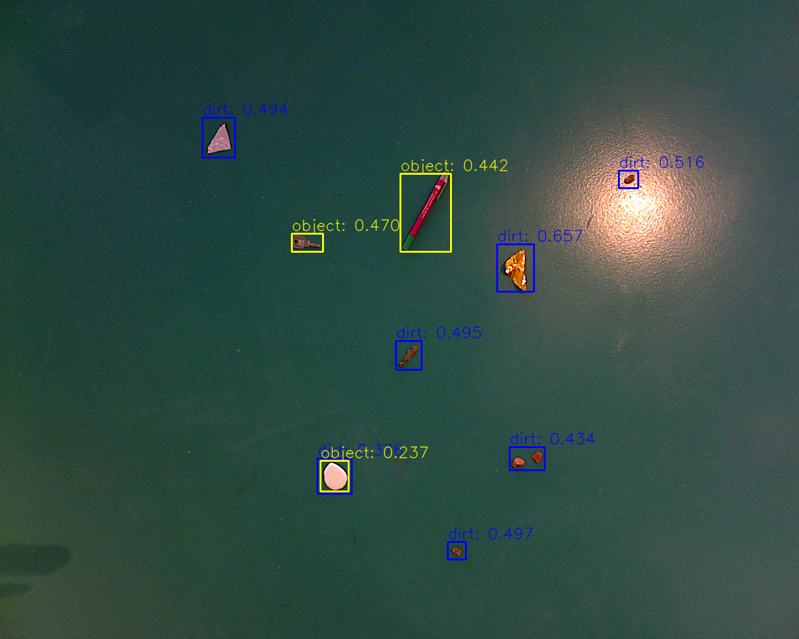

### Results in synthetic test set with test floors (TestSynth)

#### 10 classes

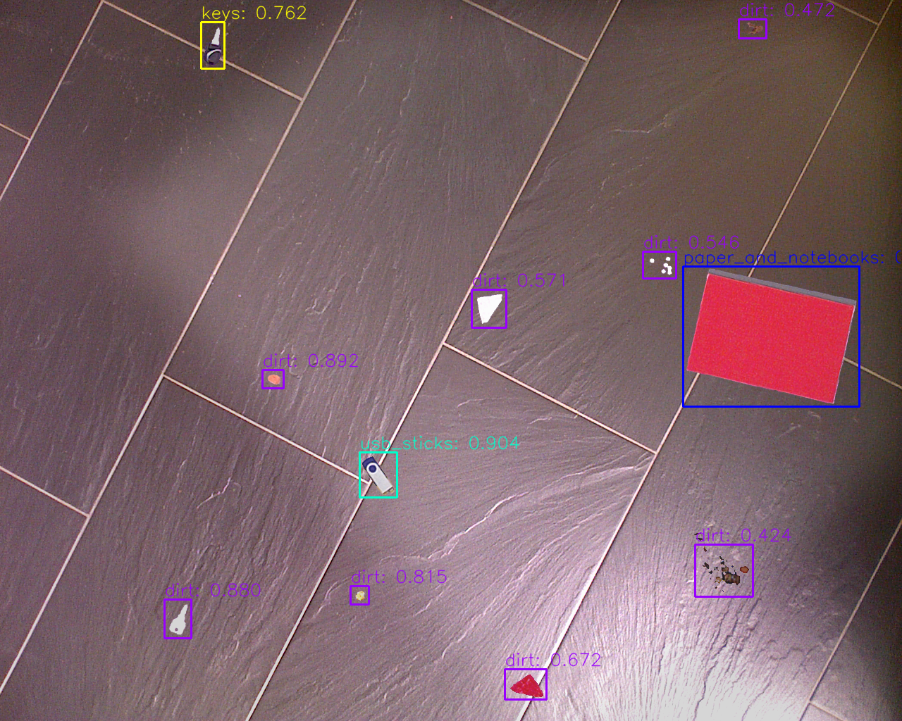
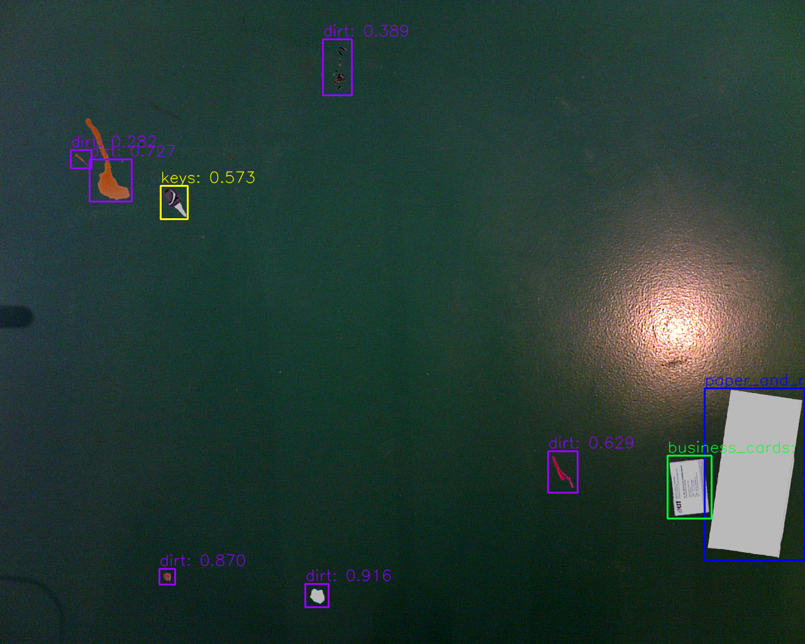

#### 2 classes

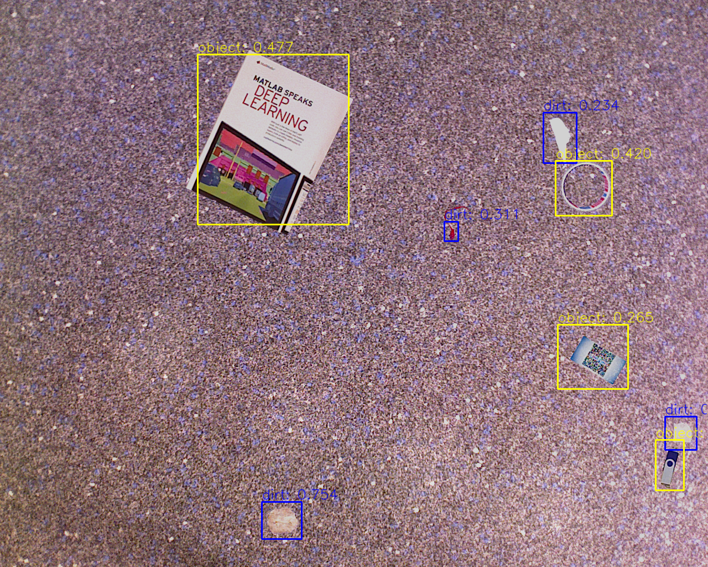
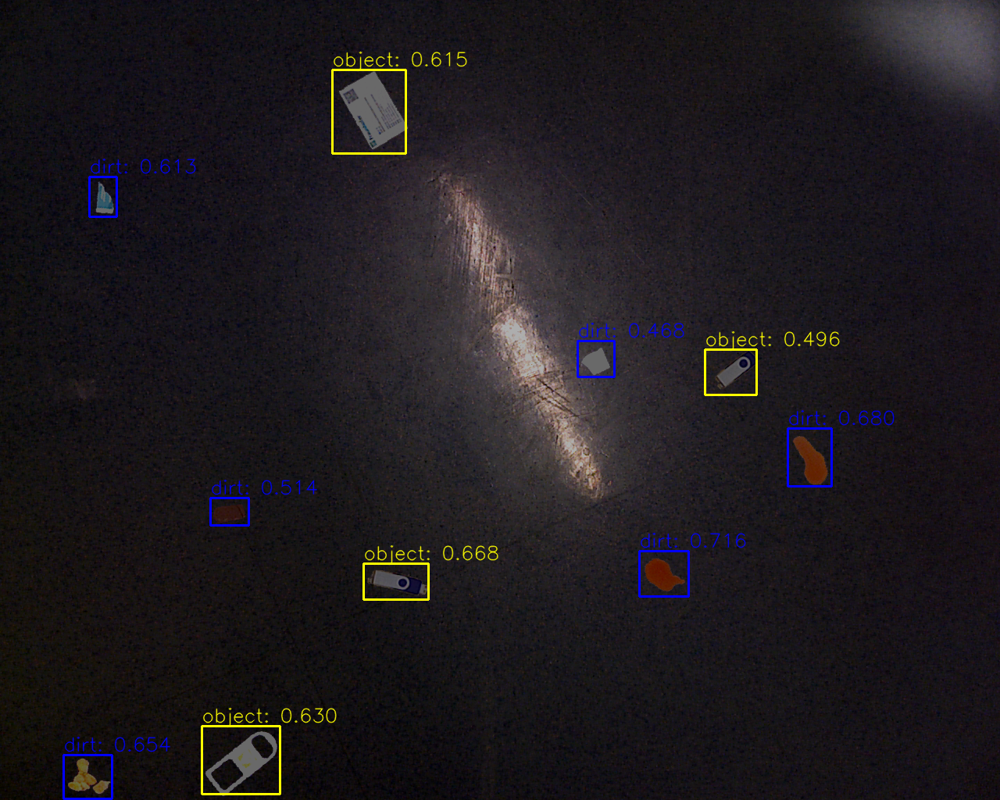

### Example with low performance

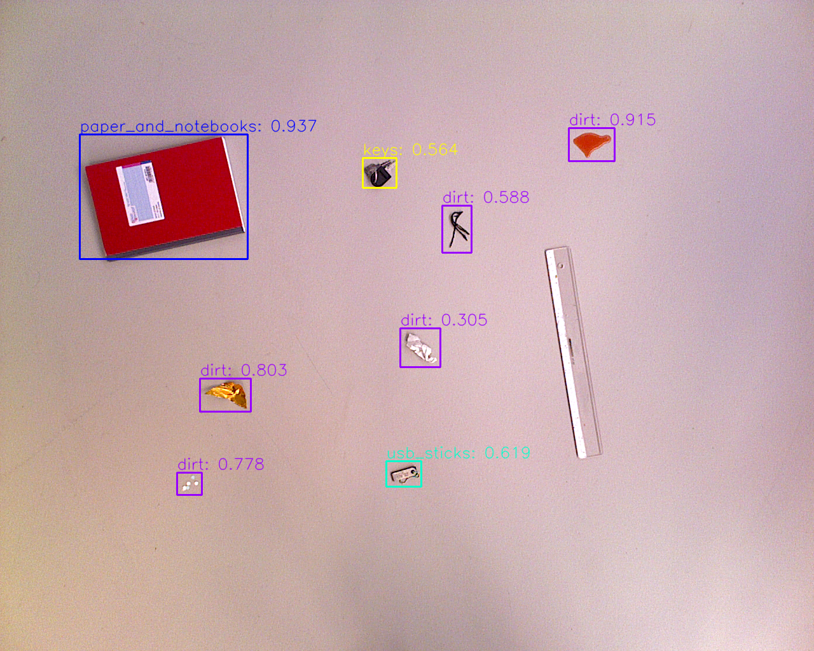
