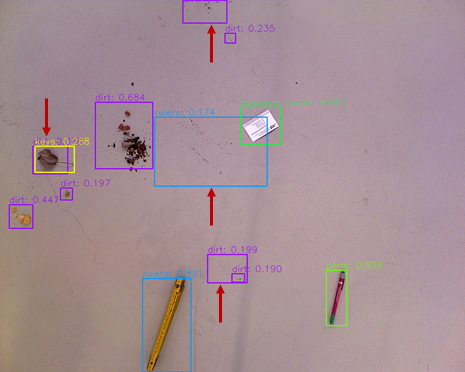
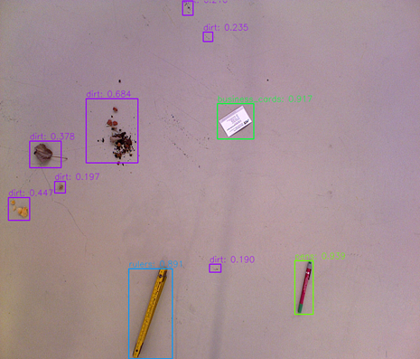
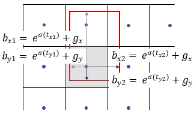

# DirtNet improvements over standard YOLO v3

## Improvements by each item

mAP reported in dirt dataset with real test images for 2 classes

| Improvements                                | mAP  | delta | cumulate delta | BFLOPs |
| ------------------------------------------- | ---- | ----- | -------------- | ------ |
| baseline (with darknet53)                   | 78.2 | 0.0   | 0.0            | 396.66 |
| + rectangle training and inference          | 78.5 | + 0.3 | + 0.3          | 322.29 |
| + thresholds for diff layers                | 79.1 | + 0.6 | + 0.9          | 322.29 |
| + GIOU loss [1]                             | 80.0 | + 0.9 | + 1.8          | 322.29 |
| + focal loss [2]                            | 81.4 | + 1.4 | + 3.2          | 322.29 |
| + cosine lr & warm up [3]                   | 82.9 | + 1.5 | + 4.7          | 322.29 |
| + mixup [4]                                 | 84.6 | + 1.7 | + 6.4          | 322.29 |
| + label smooth [5]                          | 85.5 | + 0.9 | + 7.3          | 322.29 |
| + backbone mobilenetv2 [6]                  | 82.1 | - 3.4 | + 3.9          | 89.35  |
| + separable convolution [7]                 | 82.0 | - 0.1 | + 3.8          | 26.68  |
| + redesign layers based on receptive fields | 83.7 | + 1.7 | + 5.5          | 21.49  |
| + remove predefined anchors                 | 83.8 | + 0.1 | + 5.6          | 21.45  |

mAP reported in dirt dataset with real test images for 10 classes

| Improvements                                | mAP  | delta | cumulate delta | BFLOPs |
| ------------------------------------------- | ---- | ----- | -------------- | ------ |
| baseline (with darknet53)                   | 73.5 | 0.0   | 0.0            | 396.66 |
| + rectangle training and inference          | 73.7 | + 0.2 | + 0.2          | 322.29 |
| + thresholds for diff layers                | 74.2 | + 0.5 | + 0.7          | 322.29 |
| + GIOU loss [1]                             | 75.0 | + 0.8 | + 1.5          | 322.29 |
| + focal loss [2]                            | 76.5 | + 1.5 | + 3.0          | 322.29 |
| + cosine lr & warm up [3]                   | 77.9 | + 1.4 | + 4.4          | 322.29 |
| + mixup [4]                                 | 79.5 | + 1.6 | + 6.0          | 322.29 |
| + label smooth [5]                          | 80.7 | + 1.2 | + 7.2          | 322.29 |
| + backbone mobilenetv2 [6]                  | 76.0 | - 4.7 | + 2.5          | 89.35  |
| + separable convolution [7]                 | 75.9 | - 0.1 | + 2.4          | 26.68  |
| + redesign layers based on receptive fields | 77.0 | + 1.1 | + 3.5          | 21.49  |
| + remove predefined anchors                 | 77.1 | + 0.1 | + 3.6          | 21.45  |

- network inference with resized resolution 832 * 1024

### Time in CPU with MobileNetV2
| Preprocessing | Inference & Postprocessing | Sum     |
| ------------- | -------------------------- | ------- |
| 4.1 ms        | 38.8 ms                    | 42.9 ms |

- Camera resolution 1024 * 1280, network inference with resolution 832 * 1024
- Intel Core i7-7700K CPU @ 4.20GHz * 8
- Use Openvino model optimizer and inference engine [14]

### Pascal dataset
| Detector           | VOC07 (mAP@IoU=0.5) |
| ------------------ | ------------------- |
| Faster R-CNN [8]   | 73.2 (07+12)        |
| SSD [9]            | 76.8 (07+12)        |
| YOLO V3 [10][15]   | 79.6 (07+12)        |
| DirtNet-D          | 84.1 (07+12)        |
| DirtNet-M          | 79.0 (07+12)        |


### Rectangle training and inference

Instead of keeping the ratio, padding the image as preprocessing in original YOLO V3 [10], we resize the image to desired resolution without padding. This saves 19% FLOPs of the detector, which allows the training and inference phase much faster with even slightly higher mAP.

### Thresholds for different layers

Like YOLO V3 [10] and detectors with FPN [11], detect small objects in shallow layer which contains more detail and edge information, detect large objects in deep layer which contains more abstract semantic representation. The larger objects with more features representation trend to have higher confidence. In the task of dirt detection, some dirt is smaller than 15 * 15 pixel, some stationeries like books or rulers are larger than 200 * 200 pixel in one image. In order to recall more small dirt, we have to reduce the confidence threshold, but it will cause more false positive detections from higher layer due to the different patterns of the floor. This hurts precision a lot and causes our robot running around. Therefore, we implemente a low confidence threshold in the small object, and higher confidence threshold in the middle object and large object detection branches. Then merge bounding boxes from 3 layers and implement the NMS.



figure 1. Use the same confidence threshold for 3 detection branches. Red arrows show the false positive detection from middle and large object detection branches.



figure 2. Implement different confidence thresholds for 3 detection branches.

### Loss function, cosine learning rate, mixup, label smoothing

We use GIOU loss [1] for bounding box regression, focal loss [2] for foreground and background classification, which improve the mAP 0.9 and 1.4 respectively. Inspired by SGDR [3], we also use warm up and cosine learning rate schedule, which improve the mAP 1.5. We also introduce mixup [4] to our training pipeline, having 1.7 mAP Improvement. Inspired by Inception v2 [5], we also introduce label smooth for categorie classification.

### Backbone MobileNetV2

In order to detect in real time in mobile platform, we replace the backbone Darknet53 with MobileNetV2, which reduces the BFLOPs from 322.29 to 89.35. Furthermore, Inspired by Xception [7], we replace the convolutional layers in detection branches with depthwise separable convolutional layers keeping the same parameter. This further reduces the BFLOPs from 89.35 to 26.68 with almost unchanged mAP. Like discuss in [12], receptive field also affects the detection performance. Since in dirt detection, more context information will even mix the dirt with the floor’s pattern and increase the risk that some small dirt disappears after many convolutional layers, larger receptive field even hurts the detection result for small dirt. Therefore, we redesign the layers in the detection branches. We reduce one 1 * 1 and 3 * 3 convolutional layers in the small object detection branch. Since the receptive field from the last layer of mobilenet v2 is not large enough for large object detection with a relative higher resolution input, we add one 3 * 3 convolutional layer in the large object detection branch. And we cancel the last layer from mobilenet v2, as the features are already enough for our detection task.

### Remove predefined anchors

Through kmean is proposed in YOLO9000 [13] for determining bounding box priors, it is sensitive to the data distribution and initial value, we still face the problem to find the optimized predefined anchors. Therefore, we remove the predefined anchors, which introduce many hyper-parameters for training phase.



figure 3.  We directly regress 2 corners’ offsets t_x1, t_y1, t_x2, t_y2 from the center of the feature map grid. b_x1, b_y1, b_x2, b_y2 are the coordinates of the bounding box, σ stands for sigmoid function, g_x, g_y are the center's coordinates of the grid.

In the task of dirt detection, all the foregrounds are in the same plane, namely laying in the floor. Because we have 3 layers, which are responsible for different scale objects detection. It is enough for some overlap situations. Therefore, we further more reduce the regressed anchor of 1 feature map grid from 3 to 1, saving 0.04 BFLOPs.

## References

```
[1] Generalized Intersection over Union: A Metric and A Loss for Bounding Box Regression
https://arxiv.org/abs/1902.09630
@article{Rezatofighi_2018_CVPR,
  author    = {Rezatofighi, Hamid and Tsoi, Nathan and Gwak, JunYoung and Sadeghian, Amir and Reid, Ian and Savarese, Silvio},
  title     = {Generalized Intersection over Union},
  booktitle = {The IEEE Conference on Computer Vision and Pattern Recognition (CVPR)},
  month     = {June},
  year      = {2019},
}
[2] Focal Loss for Dense Object Detection
https://arxiv.org/abs/1708.02002
@article{Lin2017FocalLF,
  title={Focal Loss for Dense Object Detection},
  author={Tsung-Yi Lin and Priya Goyal and Ross B. Girshick and Kaiming He and Piotr Doll{\'a}r},
  journal={2017 IEEE International Conference on Computer Vision (ICCV)},
  year={2017},
  pages={2999-3007}
}
[3] SGDR: Stochastic Gradient Descent with Warm Restarts
https://arxiv.org/abs/1608.03983
@inproceedings{Loshchilov2016SGDRSG,
  title={SGDR: Stochastic Gradient Descent with Warm Restarts},
  author={Ilya Loshchilov and Frank Hutter},
  booktitle={ICLR},
  year={2016}
}
[4] mixup: Beyond Empirical Risk Minimization
https://arxiv.org/abs/1710.09412
@article{Zhang2017mixupBE,
  title={mixup: Beyond Empirical Risk Minimization},
  author={Hongyi Zhang and Moustapha Ciss{\'e} and Yann Dauphin and David Lopez-Paz},
  journal={ArXiv},
  year={2017},
  volume={abs/1710.09412}
}
[5] Rethinking the Inception Architecture for Computer Vision
https://arxiv.org/abs/1512.00567
@article{Szegedy2015RethinkingTI,
  title={Rethinking the Inception Architecture for Computer Vision},
  author={Christian Szegedy and Vincent Vanhoucke and Sergey Ioffe and Jonathon Shlens and Zbigniew Wojna},
  journal={2016 IEEE Conference on Computer Vision and Pattern Recognition (CVPR)},
  year={2015},
  pages={2818-2826}
}
[6] MobileNetV2: Inverted Residuals and Linear Bottlenecks
https://arxiv.org/abs/1801.04381
@article{Sandler2018MobileNetV2IR,
  title={MobileNetV2: Inverted Residuals and Linear Bottlenecks},
  author={Mark Sandler and Andrew G. Howard and Menglong Zhu and Andrey Zhmoginov and Liang-Chieh Chen},
  journal={2018 IEEE/CVF Conference on Computer Vision and Pattern Recognition},
  year={2018},
  pages={4510-4520}
}
[7] Xception: Deep Learning with Depthwise Separable Convolutions
https://arxiv.org/abs/1610.02357
@article{Chollet2016XceptionDL,
  title={Xception: Deep Learning with Depthwise Separable Convolutions},
  author={François Chollet},
  journal={2017 IEEE Conference on Computer Vision and Pattern Recognition (CVPR)},
  year={2016},
  pages={1800-1807}
}
[8] Faster R-CNN: Towards Real-Time Object Detection with Region Proposal Networks
https://arxiv.org/abs/1506.01497
@article{Ren2015FasterRT,
  title={Faster R-CNN: Towards Real-Time Object Detection with Region Proposal Networks},
  author={Shaoqing Ren and Kaiming He and Ross B. Girshick and Jian Sun},
  journal={IEEE Transactions on Pattern Analysis and Machine Intelligence},
  year={2015},
  volume={39},
  pages={1137-1149}
}
[9] SSD: Single Shot MultiBox Detector
https://arxiv.org/abs/1512.02325
@inproceedings{Liu2016SSDSS,
  title={SSD: Single Shot MultiBox Detector},
  author={Weiwei Liu and Dragomir Anguelov and Dumitru Erhan and Christian Szegedy and Scott E. Reed and Cheng-Yang Fu and Alexander C. Berg},
  booktitle={ECCV},
  year={2016}
}
[10] YOLOv3: An Incremental Improvement
https://arxiv.org/abs/1804.02767
@article{Redmon2018YOLOv3AI,
  title={YOLOv3: An Incremental Improvement},
  author={Joseph Redmon and Ali Farhadi},
  journal={ArXiv},
  year={2018},
  volume={abs/1804.02767}
}
[11] Feature Pyramid Networks for Object Detection
https://arxiv.org/abs/1612.03144
@article{Lin2016FeaturePN,
  title={Feature Pyramid Networks for Object Detection},
  author={Tsung-Yi Lin and Piotr Doll{\'a}r and Ross B. Girshick and Kaiming He and Bharath Hariharan and Serge J. Belongie},
  journal={2017 IEEE Conference on Computer Vision and Pattern Recognition (CVPR)},
  year={2016},
  pages={936-944}
}
[12] Finding Tiny Faces
https://arxiv.org/abs/1612.04402
@article{Hu2016FindingTF,
  title={Finding Tiny Faces},
  author={Peiyun Hu and Deva Ramanan},
  journal={2017 IEEE Conference on Computer Vision and Pattern Recognition (CVPR)},
  year={2016},
  pages={1522-1530}
}
[13] YOLO9000: Better, Faster, Stronger
https://arxiv.org/abs/1612.08242
@article{Redmon2016YOLO9000BF,
  title={YOLO9000: Better, Faster, Stronger},
  author={Joseph Redmon and Ali Farhadi},
  journal={2017 IEEE Conference on Computer Vision and Pattern Recognition (CVPR)},
  year={2016},
  pages={6517-6525}
}
[14] Openvino SDK
https://software.intel.com/en-us/openvino-toolkit

[15] yolo github
https://github.com/TencentYoutuResearch/ObjectDetection-OneStageDet/tree/master/yolo
https://github.com/ultralytics/yolov3/issues/310
```
