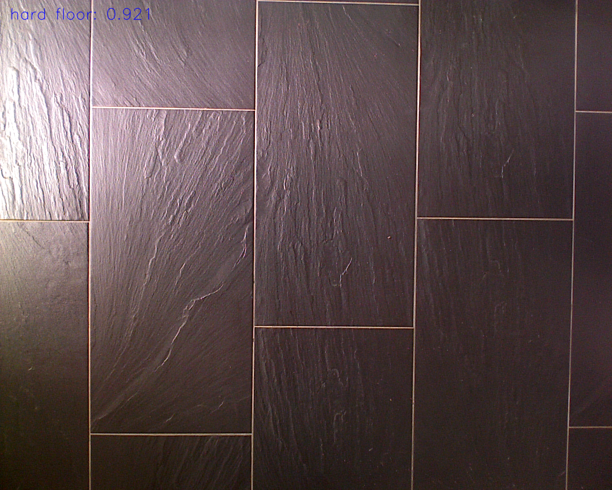
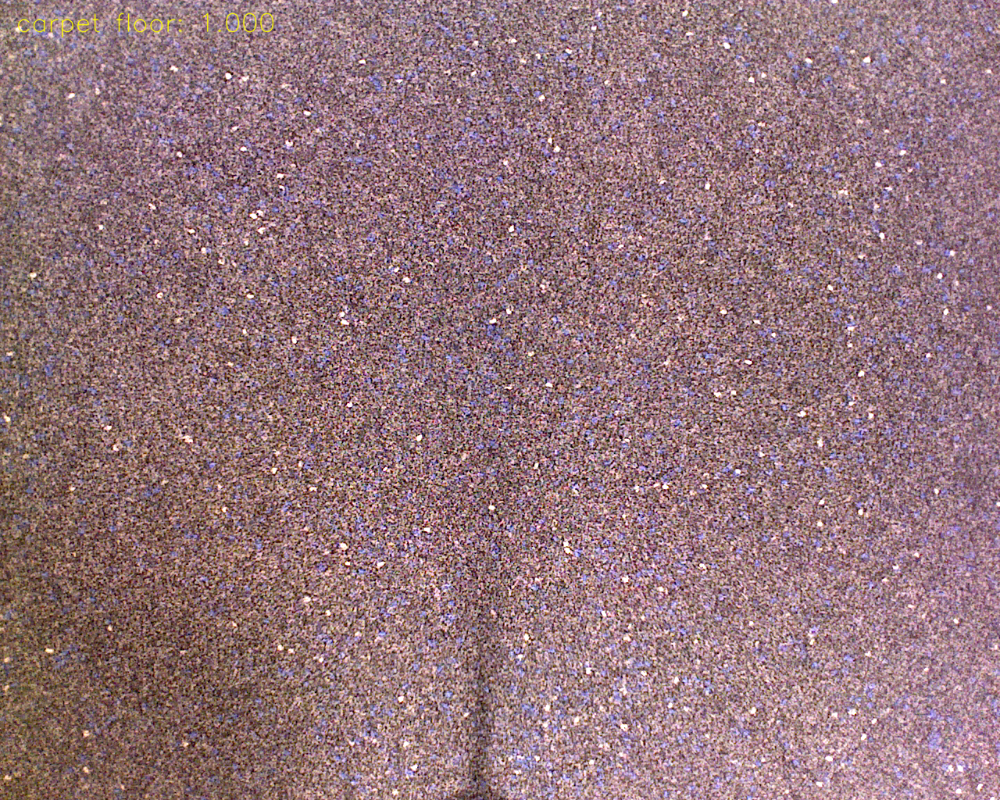
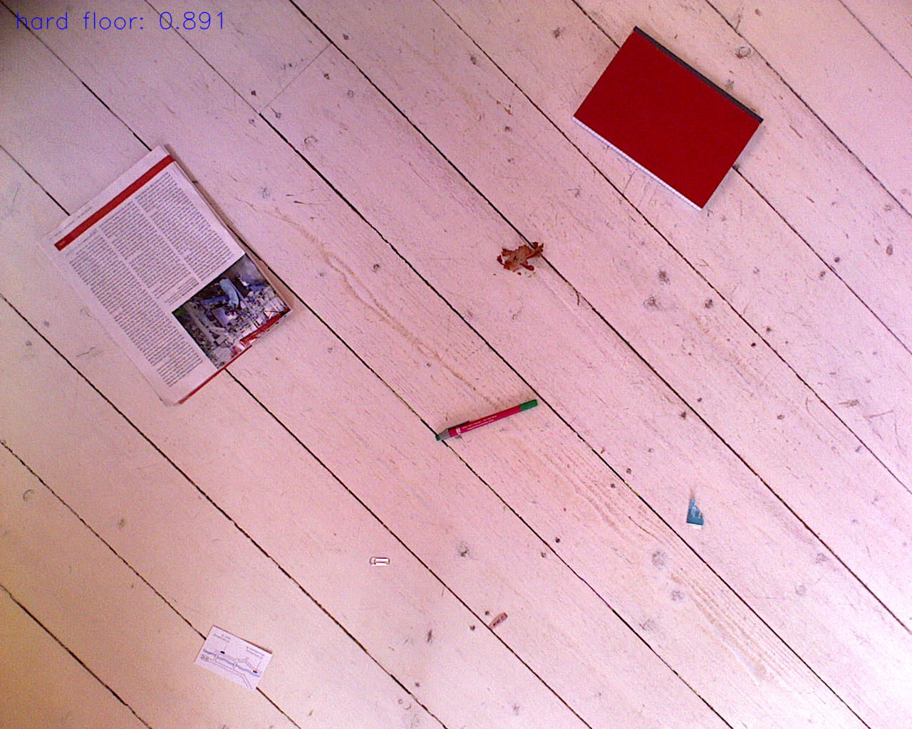
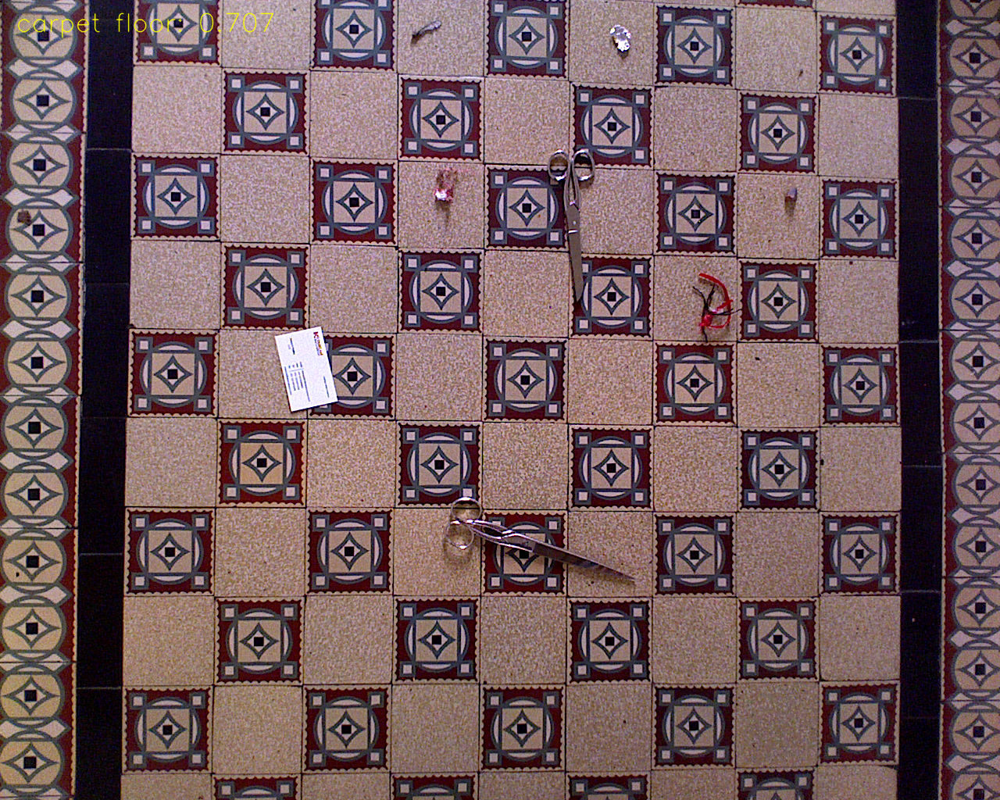
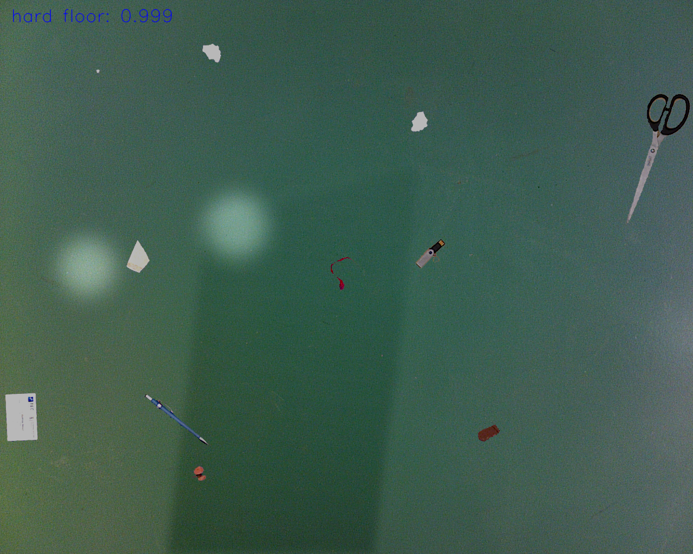
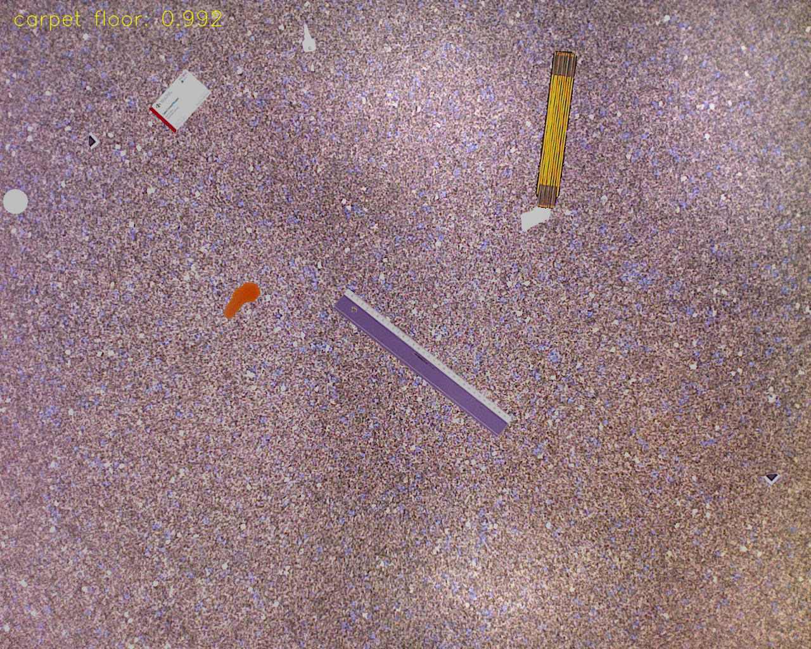
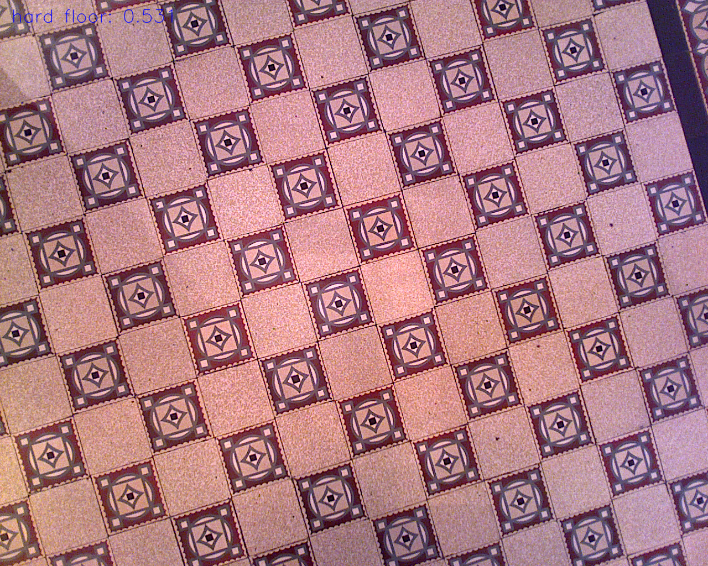
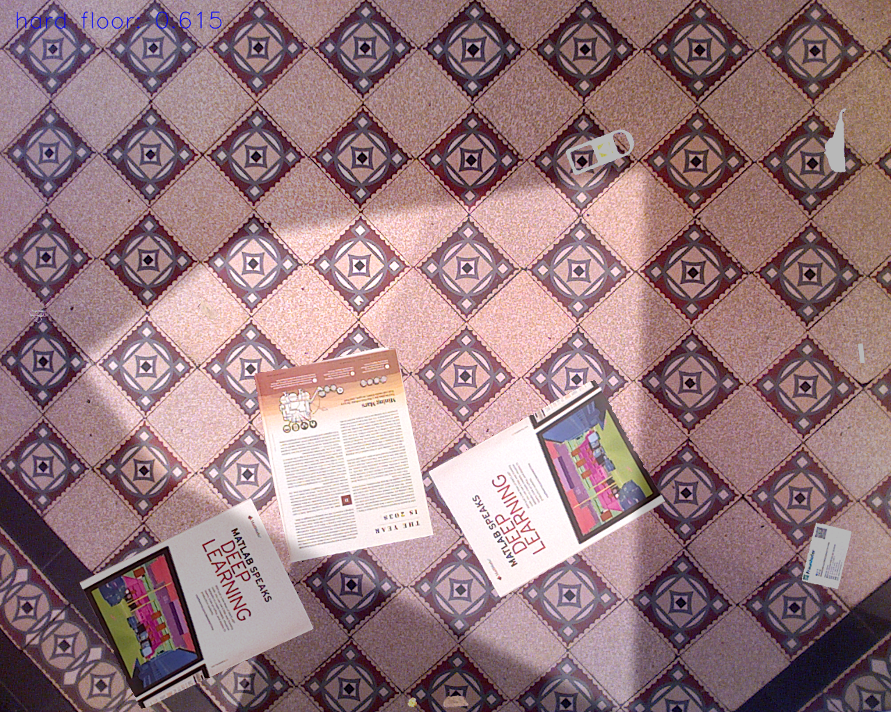
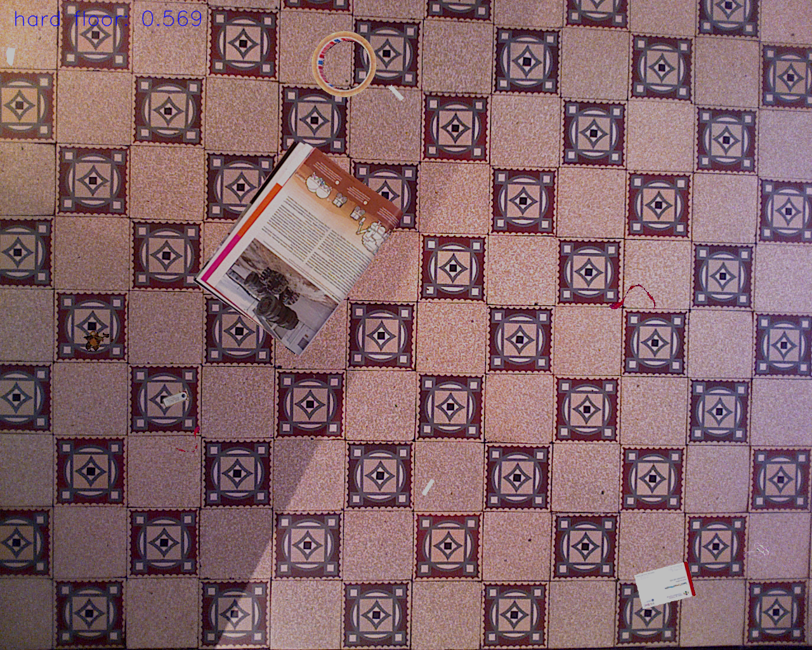

# Classify floor type experiment set up

### Original distribution of floor type in training and test set
- 0: hard floor
- 1: carpet floor

#### In training set
| floor index | 0   | 1   | 2   | 3   | 4   | 5   | 6   | 7   | 8   | 9   | 10  | 11  | 12  | 13  | 14  | 15  | 16  | 17  | 18  | 19  | 20  |
| ----------- | --- | --- | --- | --- | --- | --- | --- | --- | --- | --- | --- | --- | --- | --- | --- | --- | --- | --- | --- | --- | --- |
| floor type  | 0   | 1   | 0   | 0   | 1   | 0   | 1   | 1   | 0   | 1   | 0   | 0   | 0   | 1   | 0   | 0   | 0   | 0   | 0   | 0   | 0    |

#### In test set
| floor index | 0   | 1   | 2   | 3   | 4   | 5   | 6   | 7   | 8   |
| ----------- | --- | --- | --- | --- | --- | --- | --- | --- | --- |
| floor type  | 0   | 0   | 0   | 0   | 1   | 0   | 0   | 1   | 0   |

### Training set and test set set up
#### Training set
- use all synthetic training floors with dirt

| Synthetic image for training |
| ---------------------------- |
| 9248                         |

#### Test set
- image with dirt in real test
- image with dirt in synthetic test
- clean test floors

### Result
#### image with dirt in real test
| image number | accuracy |
| ------------ | -------- |
| 90           | 100%     |

#### image with dirt in synthetic test
| image number | accuracy |
| ------------ | -------- |
| 1552         | 96.8%    |

#### clean test floors
| image number | accuracy |
| ------------ | -------- |
| 194         | 99.4%    |

### Choice Mobilenetv2 as CNN backbone
- It is able to run in real time
- It can be further integrated into our dirt detection network as multi-tasks learning without additional computation complexity

### Training strategies
- 2 output nodes with sigmoid activation
- use binary_crossentropy
- lock backbone, use optimizer adam for 2 epoch (split all training set to 2 parts)
- unlock backbone, use optimizer SGD for 1 epoch (all training set)

### TODO
1. Mix clean floor and dirt floor as training set
2. optimize the network
3. integrate into dirt detection network as multi tasks learning

### Appendix

#### result images

##### image in clean test floor

##### image in real test with dirt

##### image in synthetic test with dirt

#### Some wrong cases:

